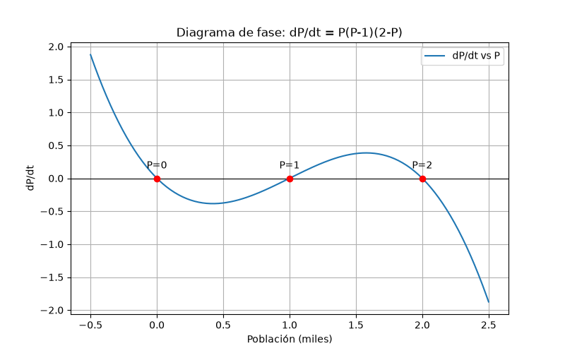
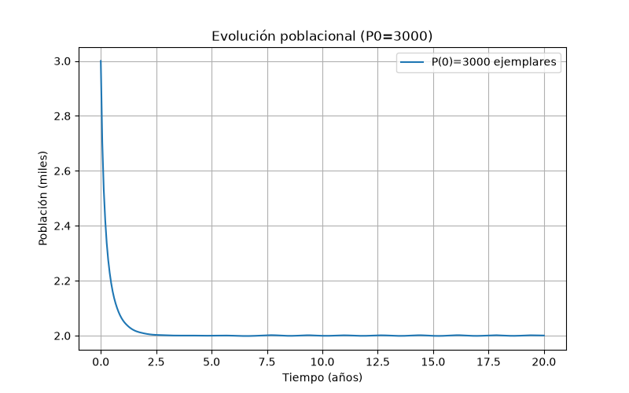
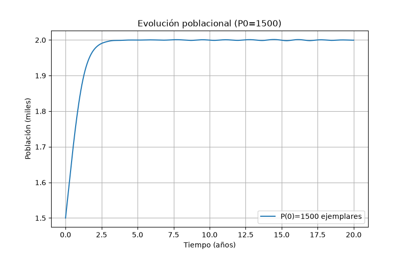
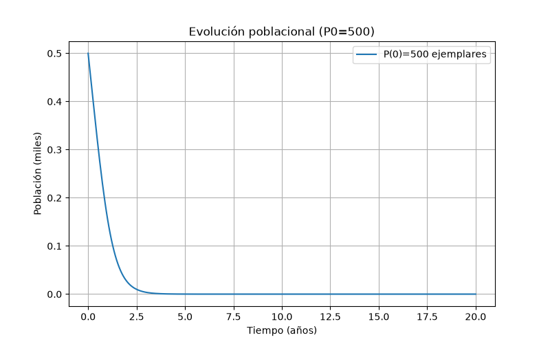
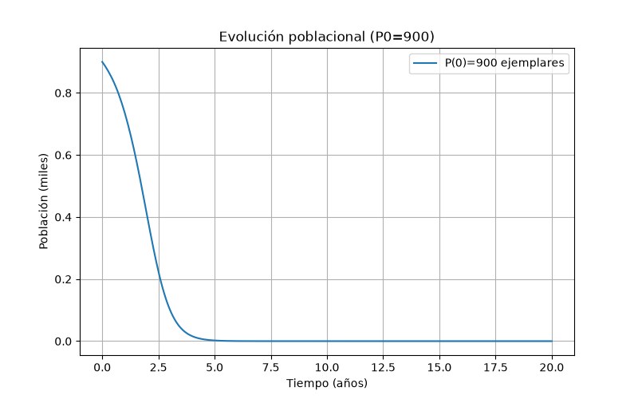

<div style="text-align:center; font-family:Arial;">

  

  <h2>ESCUELA COLOMBIANA DE INGENIERÍA JULIO GARAVITO</h2>
  <h3>UNIVERSIDAD</h3>
  <p><strong>VIGILADA MINEDUCACIÓN</strong></p>

  <h3>Departamento de Matemáticas</h3>
  <h2>Guía de trabajo 1: Campo de pendientes</h2>
  <p><strong>Competencias:</strong> R2, RM2, CM2, SP2, C3 – 2026</p>
  <p><strong>Integrante:</strong> Juan Miguel Nope Ascencio</p>

</div>

# Guía de trabajo 1: Campo de pendientes


# Ejercicio 1 - Campos de pendientes y soluciones particulares

Usando un asistente computacional, se graficaron los campos de pendientes y las soluciones particulares de las siguientes ecuaciones diferenciales:

---

## a) \( y' = -y - \sin(x), \; y(0)=1 \)

Grafica-a.jpeg

---

## b) \( y' = x + y, \; y(-2)=2 \)

_y'_=_x_+_y.png)

---

## c) \( y' = -x^2 + \sin(y) \)

_y'_=-x^2_+_sin(y).png)

---

## d) \( (x^2+1)y' + 3xy = 6x \)

_y'_=(6x_-_3xy)/(x^2+1).png)

---

## e) \( y' = x e^y \)

_y'_=_x_e^y.png)

---

## f) \( y' = x - y, \; y(1)=1 \)

_y'_=_x_-_y.png)

```python
import numpy as np
import matplotlib.pyplot as plt
from scipy.integrate import solve_ivp

# Función general para graficar campo de pendientes y solución particular
def graficar(f, x_range=(-3,3), y_range=(-3,3), cond_inicial=None, titulo=""):
    x_vals = np.linspace(x_range[0], x_range[1], 25)  # más puntos
    y_vals = np.linspace(y_range[0], y_range[1], 25)
    X, Y = np.meshgrid(x_vals, y_vals)

    U = np.ones_like(X)
    V = f(X, Y)

    # Normalizar para que todas las flechas tengan la misma longitud
    N = np.sqrt(U**2 + V**2)
    U, V = U/N, V/N

    plt.figure(figsize=(8,6))
    plt.quiver(X, Y, U, V, angles="xy", scale=40, width=0.003)  # width controla grosor
    plt.title(titulo)
    plt.xlabel("x")
    plt.ylabel("y")
    plt.grid(True)

    if cond_inicial:
        sol = solve_ivp(f, [x_range[0], x_range[1]], [cond_inicial[1]],
                        t_eval=np.linspace(x_range[0], x_range[1], 200))
        plt.plot(sol.t, sol.y[0], 'r', label=f"Solución particular y({cond_inicial[0]})={cond_inicial[1]}")
        plt.legend()

    plt.show()

def graficar_cd(f, x_range=(-2,2), y_range=(-2,2), cond_inicial=None, titulo=""):
    # Más puntos para mayor detalle
    x_vals = np.linspace(x_range[0], x_range[1], 50)
    y_vals = np.linspace(y_range[0], y_range[1], 50)
    X, Y = np.meshgrid(x_vals, y_vals)

    U = np.ones_like(X)
    V = f(X, Y)

    # Recorte dinámico: calcula percentiles y limita extremos
    v_min, v_max = np.percentile(V, [10, 90])
    V = np.clip(V, v_min, v_max)

    # Normalizar para que todas las flechas sean pequeñas
    N = np.sqrt(U**2 + V**2)
    U, V = U/N, V/N

    plt.figure(figsize=(8,6))
    plt.quiver(X, Y, U, V, angles="xy", scale=70, width=0.002, headwidth=3, headlength=4)
    plt.title(titulo)
    plt.xlabel("x")
    plt.ylabel("y")
    plt.grid(True)

    if cond_inicial:
        sol = solve_ivp(f, [x_range[0], x_range[1]], [cond_inicial[1]],
                        t_eval=np.linspace(x_range[0], x_range[1], 400))
        plt.plot(sol.t, sol.y[0], 'r', label=f"Solución particular y({cond_inicial[0]})={cond_inicial[1]}")
        plt.legend()

    plt.show()


# a) y' = -y - sin(x), y(0)=1
graficar(lambda x,y: -y - np.sin(x), cond_inicial=(0,1), titulo="a) y' = -y - sin(x)")

# b) y' = x + y, y(-2)=2
graficar(lambda x,y: x + y, cond_inicial=(-2,2), titulo="b) y' = x + y")

# c) y' = -x^2 + sin(y), y(0)=0
graficar_cd(lambda x,y: -x**2 + np.sin(y), cond_inicial=(0,0), titulo="c) y' = -x^2 + sin(y)")

# d) y' = (6x - 3xy)/(x^2+1), y(0)=0
graficar_cd(lambda x,y: (6*x - 3*x*y)/(x**2+1), cond_inicial=(0,0), titulo="d) y' = (6x - 3xy)/(x^2+1)")


# e) y' = x e^y, ejemplo con y(0)=0
graficar(lambda x,y: x*np.exp(y), cond_inicial=(0,0), titulo="e) y' = x e^y")

# f) y' = x - y, y(1)=1
graficar(lambda x,y: x - y, cond_inicial=(1,1), titulo="f) y' = x - y")
```

# Punto 3 - Modelo Poblacional

Sea \( P(t) \) la población de cierta especie en un parque natural, con \( t \) tiempo en años y \( P \) en miles.  
La ecuación diferencial:


\[
\frac{dP}{dt} = P(P - 1)(2 - P)
\]


describe la tasa de cambio de la población de la especie en el instante \( t \).

---

## a) Diagrama de fase

El diagrama de fase muestra los puntos de equilibrio en \( P=0, P=1, P=2 \).  
- \( P=0 \) y \( P=2 \) son **estables**.  
- \( P=1 \) es **inestable**.  



---

## b) Población inicial de 3000 ejemplares

La población decrece y se estabiliza en **2000 ejemplares**.



---

## c) Población inicial de 1500 ejemplares

La población crece y se estabiliza en **2000 ejemplares**.



---

## d) Población inicial de 500 ejemplares

La población decrece hasta la **extinción**.



---

## e) Población inicial de 900 ejemplares

La población está por debajo del umbral crítico \( P=1 \).  
No puede crecer hasta 1100, en cambio tiende a **0 ejemplares**.




```python
import numpy as np
import matplotlib.pyplot as plt
from scipy.integrate import solve_ivp

# Ecuación diferencial del modelo poblacional
def dP_dt(t, P):
    return P * (P - 1) * (2 - P)

# a) Diagrama de fase
def diagrama_fase():
    P_vals = np.linspace(-0.5, 2.5, 200)
    dP_vals = dP_dt(0, P_vals)

    plt.figure(figsize=(8,5))
    plt.axhline(0, color="black", linewidth=0.8)
    plt.plot(P_vals, dP_vals, label="dP/dt vs P")

    # Puntos de equilibrio
    for eq in [0, 1, 2]:
        plt.plot(eq, 0, "ro")
        plt.text(eq, 0.15, f"P={eq}", ha="center")

    plt.title("Diagrama de fase: dP/dt = P(P-1)(2-P)")
    plt.xlabel("Población (miles)")
    plt.ylabel("dP/dt")
    plt.grid(True)
    plt.legend()
    plt.savefig("fase.png")   # guarda imagen
    plt.close()

# Función para simular evolución de la población
def simular(P0, nombre, t_max=20):
    sol = solve_ivp(dP_dt, [0, t_max], [P0], t_eval=np.linspace(0, t_max, 300))
    plt.figure(figsize=(8,5))
    plt.plot(sol.t, sol.y[0], label=f"P(0)={P0*1000:.0f} ejemplares")
    plt.title(f"Evolución poblacional (P0={P0*1000:.0f})")
    plt.xlabel("Tiempo (años)")
    plt.ylabel("Población (miles)")
    plt.grid(True)
    plt.legend()
    plt.savefig(nombre)   # guarda imagen
    plt.close()

if __name__ == "__main__":
    # a) Diagrama de fase
    diagrama_fase()

    # b) Población inicial 3000 ejemplares
    simular(3, "poblacion_3000.png")

    # c) Población inicial 1500 ejemplares
    simular(1.5, "poblacion_1500.png")

    # d) Población inicial 500 ejemplares
    simular(0.5, "poblacion_500.png")

    # e) Población inicial 900 ejemplares
    simular(0.9, "poblacion_900.png")

```


