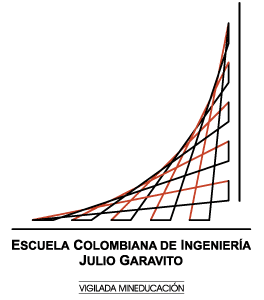
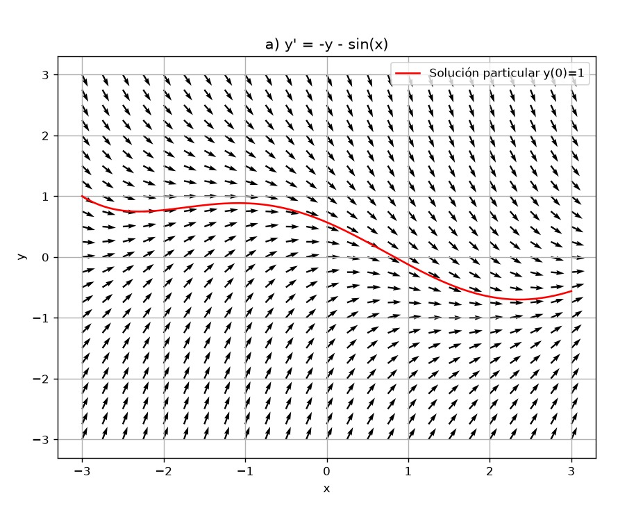
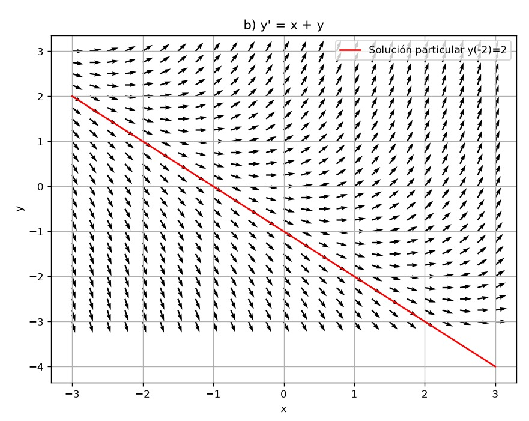
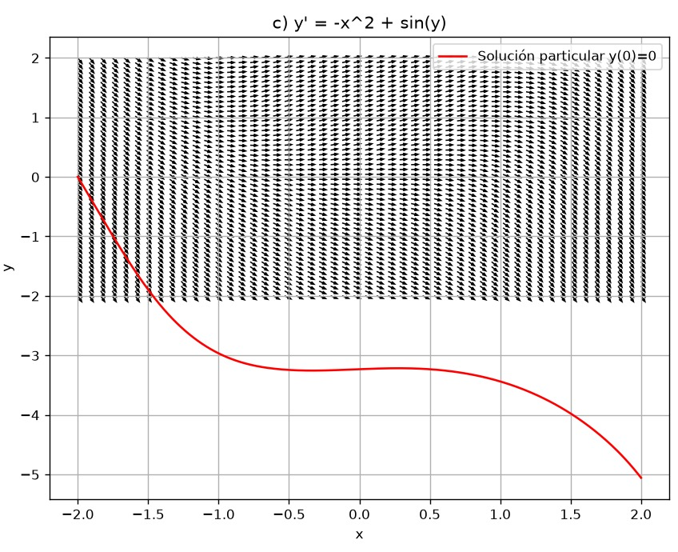
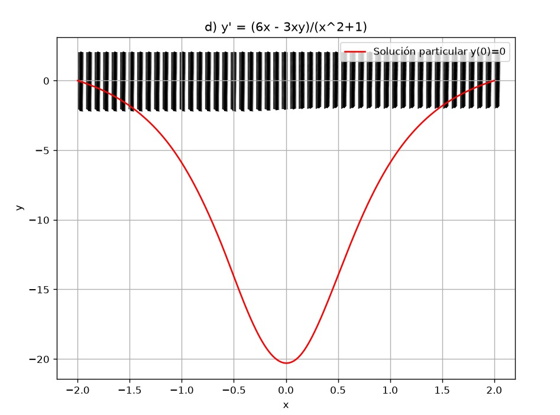
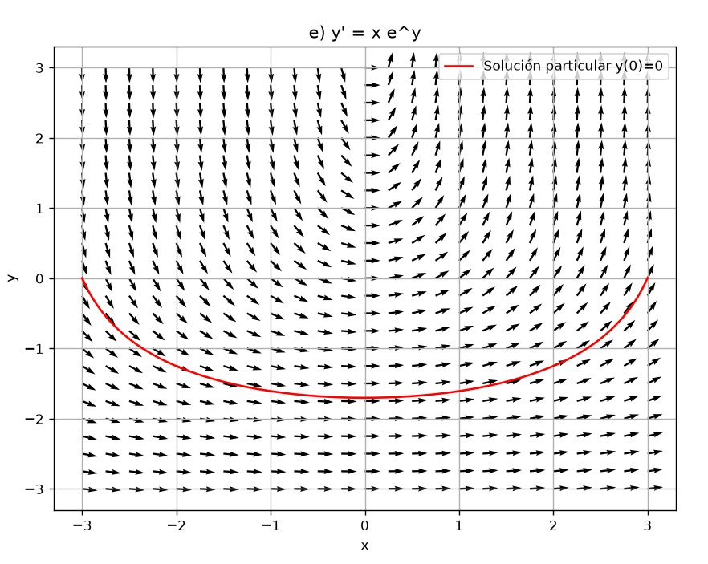
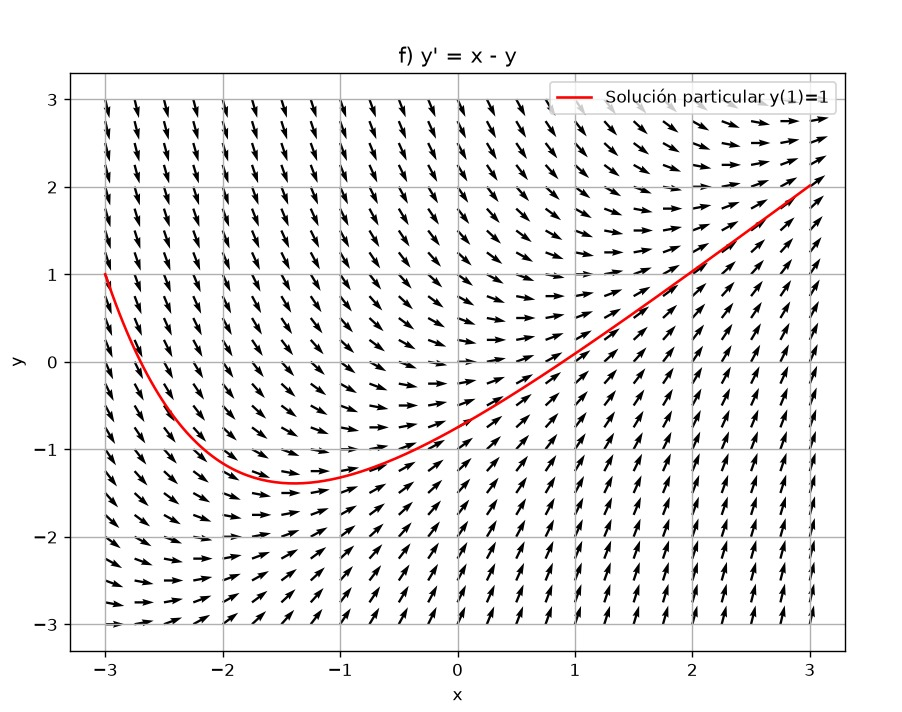
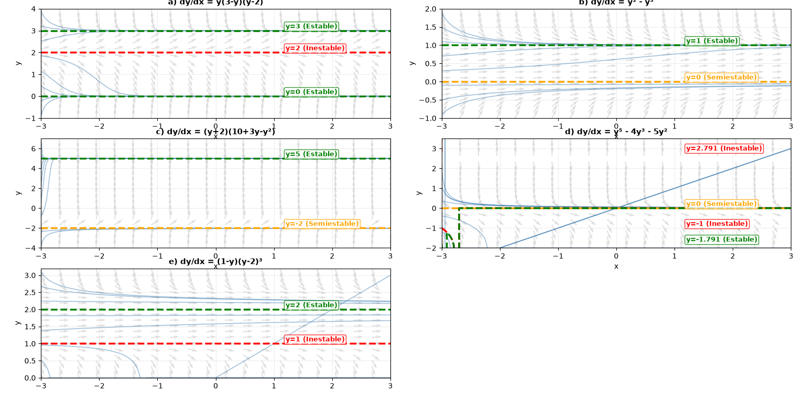
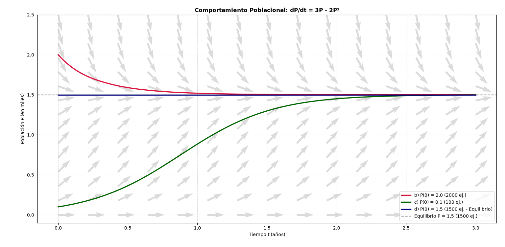

<div style="text-align:center; font-family:Arial;">

  <p align="center">
    
  </p>

  <h2>ESCUELA COLOMBIANA DE INGENIERÍA JULIO GARAVITO</h2>
  <h3>UNIVERSIDAD</h3>
  <p><strong>VIGILADA MINEDUCACIÓN</strong></p>

  <h3>Departamento de Matemáticas</h3>
  <h2>Guía de trabajo 1: Campo de pendientes</h2>
  <p><strong>Competencias:</strong> R2, RM2, CM2, SP2, C3 - 2026</p>
  <p><strong>Integrante:</strong> Juan Miguel Nope Ascencio</p>
  <p><strong>Integrante:</strong> Sebastian Lopez Rincon</p>

</div>


# Guía de trabajo 1: Campo de pendientes


# Ejercicio 1 - Campos de pendientes y soluciones particulares

Usando un asistente computacional, se graficaron los campos de pendientes y las soluciones particulares de las siguientes ecuaciones diferenciales:

---

## a) \( y' = -y - \sin(x), \; y(0)=1 \)

<p align="center">
  
</p>

---

## b) \( y' = x + y, \; y(-2)=2 \)

<p align="center">
  
</p>

---

## c) \( y' = -x^2 + \sin(y) \)

<p align="center">
  
</p>


---

## d) \( (x^2+1)y' + 3xy = 6x \)


<p align="center">
  
</p>

---

## e) \( y' = x e^y \)

<p align="center">
  
</p>

---

## f) \( y' = x - y, \; y(1)=1 \)


<p align="center">
  
</p>


```python
import numpy as np
import matplotlib.pyplot as plt
from scipy.integrate import solve_ivp

# Función general para graficar campo de pendientes y solución particular
def graficar(f, x_range=(-3,3), y_range=(-3,3), cond_inicial=None, titulo=""):
    x_vals = np.linspace(x_range[0], x_range[1], 25)  # más puntos
    y_vals = np.linspace(y_range[0], y_range[1], 25)
    X, Y = np.meshgrid(x_vals, y_vals)

    U = np.ones_like(X)
    V = f(X, Y)

    # Normalizar para que todas las flechas tengan la misma longitud
    N = np.sqrt(U**2 + V**2)
    U, V = U/N, V/N

    plt.figure(figsize=(8,6))
    plt.quiver(X, Y, U, V, angles="xy", scale=40, width=0.003)  # width controla grosor
    plt.title(titulo)
    plt.xlabel("x")
    plt.ylabel("y")
    plt.grid(True)

    if cond_inicial:
        sol = solve_ivp(f, [x_range[0], x_range[1]], [cond_inicial[1]],
                        t_eval=np.linspace(x_range[0], x_range[1], 200))
        plt.plot(sol.t, sol.y[0], 'r', label=f"Solución particular y({cond_inicial[0]})={cond_inicial[1]}")
        plt.legend()

    plt.show()

def graficar_cd(f, x_range=(-2,2), y_range=(-2,2), cond_inicial=None, titulo=""):
    # Más puntos para mayor detalle
    x_vals = np.linspace(x_range[0], x_range[1], 50)
    y_vals = np.linspace(y_range[0], y_range[1], 50)
    X, Y = np.meshgrid(x_vals, y_vals)

    U = np.ones_like(X)
    V = f(X, Y)

    # Recorte dinámico: calcula percentiles y limita extremos
    v_min, v_max = np.percentile(V, [10, 90])
    V = np.clip(V, v_min, v_max)

    # Normalizar para que todas las flechas sean pequeñas
    N = np.sqrt(U**2 + V**2)
    U, V = U/N, V/N

    plt.figure(figsize=(8,6))
    plt.quiver(X, Y, U, V, angles="xy", scale=70, width=0.002, headwidth=3, headlength=4)
    plt.title(titulo)
    plt.xlabel("x")
    plt.ylabel("y")
    plt.grid(True)

    if cond_inicial:
        sol = solve_ivp(f, [x_range[0], x_range[1]], [cond_inicial[1]],
                        t_eval=np.linspace(x_range[0], x_range[1], 400))
        plt.plot(sol.t, sol.y[0], 'r', label=f"Solución particular y({cond_inicial[0]})={cond_inicial[1]}")
        plt.legend()

    plt.show()


# a) y' = -y - sin(x), y(0)=1
graficar(lambda x,y: -y - np.sin(x), cond_inicial=(0,1), titulo="a) y' = -y - sin(x)")

# b) y' = x + y, y(-2)=2
graficar(lambda x,y: x + y, cond_inicial=(-2,2), titulo="b) y' = x + y")

# c) y' = -x^2 + sin(y), y(0)=0
graficar_cd(lambda x,y: -x**2 + np.sin(y), cond_inicial=(0,0), titulo="c) y' = -x^2 + sin(y)")

# d) y' = (6x - 3xy)/(x^2+1), y(0)=0
graficar_cd(lambda x,y: (6*x - 3*x*y)/(x**2+1), cond_inicial=(0,0), titulo="d) y' = (6x - 3xy)/(x^2+1)")


# e) y' = x e^y, ejemplo con y(0)=0
graficar(lambda x,y: x*np.exp(y), cond_inicial=(0,0), titulo="e) y' = x e^y")

# f) y' = x - y, y(1)=1
graficar(lambda x,y: x - y, cond_inicial=(1,1), titulo="f) y' = x - y")
```

---

## Punto 2: Campos de Direcciones y Estabilidad

Análisis de estabilidad para las ecuaciones diferenciales autónomas:



### Puntos de Equilibrio:
* **a) $\frac{dy}{dx} = y(3-y)(y-2)$** $\rightarrow$ $y = 3$ (Estable), $y = 2$ (Inestable), $y = 0$ (Estable)
* **b) $\frac{dy}{dx} = y^2 - y^3$** $\rightarrow$ $y = 1$ (Estable), $y = 0$ (Semiestable)
* **c) $\frac{dy}{dx} = (y+2)(10+3y-y^2)$** $\rightarrow$ $y = 5$ (Estable), $y = -2$ (Semiestable)
* **d) $\frac{dy}{dx} = y^5 - 4y^3 - 5y^2$** $\rightarrow$ $y \approx 2.79$ (Inestable), $y = 0$ (Semiestable), $y = -1$ (Inestable), $y \approx -1.79$ (Estable)
* **e) $\frac{dy}{dx} = (1-y)(y-2)^3$** $\rightarrow$ $y = 2$ (Estable), $y = 1$ (Inestable)

```python
import sys, site


sys.path.append(site.getusersitepackages())

import numpy as np
import matplotlib.pyplot as plt
from scipy.integrate import odeint


# 1. Definición de las Ecuaciones Diferenciales Autónomas

def eq_a(y, x): return y * (3 - y) * (y - 2)
def eq_b(y, x): return y**2 - y**3
def eq_c(y, x): return (y + 2) * (10 + 3*y - y**2)
def eq_d(y, x): return y**5 - 4*y**3 - 5*y**2
def eq_e(y, x): return (1 - y) * (y - 2)**3

# Configuración de ecuaciones con sus Puntos Críticos y Estabilidad
# Formato: (Título, Función, Límites Y, Puntos Críticos [(y_val, tipo, color)])
ecuaciones = [
    ("a) dy/dx = y(3-y)(y-2)", eq_a, (-1, 4), [
        (3.0, "Estable", "green"),
        (2.0, "Inestable", "red"),    
        (0.0, "Estable", "green")
    ]),
    ("b) dy/dx = y² - y³", eq_b, (-1, 2), [
        (1.0, "Estable", "green"),
        (0.0, "Semiestable", "orange")
    ]),
    ("c) dy/dx = (y+2)(10+3y-y²)", eq_c, (-4, 7), [
        (5.0, "Estable", "green"),
        (-2.0, "Semiestable", "orange")
    ]),
    ("d) dy/dx = y⁵ - 4y³ - 5y²", eq_d, (-2, 3.5), [
        (2.791, "Inestable", "red"),
        (0.0, "Semiestable", "orange"),
        (-1.0, "Inestable", "red"),
        (-1.791, "Estable", "green")
    ]),
    ("e) dy/dx = (1-y)(y-2)³", eq_e, (0, 3.2), [
        (2.0, "Estable", "green"),
        (1.0, "Inestable", "red")
    ])
]


# 2. Generación del Campo de Direcciones y Curvas Solución

fig, axes = plt.subplots(3, 2, figsize=(13, 15))
axes = axes.flatten()

x = np.linspace(-3, 3, 20)
x_sol = np.linspace(-3, 3, 200)

for idx, (titulo, f, y_lim, puntos_criticos) in enumerate(ecuaciones):
    ax = axes[idx]
    
    # Malla para el campo de direcciones
    y = np.linspace(y_lim[0], y_lim[1], 20)
    X, Y = np.meshgrid(x, y)
    
    # Campo de vectores (quiver)
    dy = f(Y, X)
    dx = np.ones(dy.shape)
    modulo = np.sqrt(dx**2 + dy**2)
    U = dx / modulo
    V = dy / modulo
    ax.quiver(X, Y, U, V, color='lightgray', alpha=0.7)
    
    # 1. Graficar trayectorias solución dinámicas
    y0_vals = np.linspace(y_lim[0] + 0.1, y_lim[1] - 0.1, 8)
    for y0 in y0_vals:
        sol = odeint(f, y0, x_sol)
        ax.plot(x_sol, sol, color='steelblue', alpha=0.5, linewidth=1.2)

    # 2. ️ Marcar explícitamente los PUNTOS DE EQUILIBRIO y su ESTABILIDAD
    for yc, tipo, color in puntos_criticos:
        # Trazar la solución exacta de equilibrio (línea continua de color)
        sol_eq = odeint(f, yc, x_sol)
        ax.plot(x_sol, sol_eq, color=color, linewidth=2.5, linestyle='--')
        
        #  Añadir etiqueta explicativa de estabilidad en el gráfico
        ax.text(1.2, yc + (y_lim[1]-y_lim[0])*0.02, f"y={yc:g} ({tipo})", 
                color=color, fontweight='bold', fontsize=9,
                bbox=dict(boxstyle="round,pad=0.2", facecolor="white", edgecolor=color, alpha=0.8))

    ax.set_xlim(-3, 3)
    ax.set_ylim(y_lim)
    ax.set_title(titulo, fontweight='bold', fontsize=11)
    ax.set_xlabel('x')
    ax.set_ylabel('y')
    ax.grid(True, linestyle=':', alpha=0.6)

# Ocultar la última subfigura vacía
fig.delaxes(axes[5])

plt.tight_layout()
plt.savefig('Figure_1.png', dpi=300)
plt.show()
```


# Punto 3 - Modelo Poblacional

Sea \( P(t) \) la población de cierta especie en un parque natural, con \( t \) tiempo en años y \( P \) en miles.  
La ecuación diferencial:


\[
\frac{dP}{dt} = P(P - 1)(2 - P)
\]


describe la tasa de cambio de la población de la especie en el instante \( t \).


## a) Diagrama de fase

El diagrama de fase muestra los puntos de equilibrio en \( P=0, P=1, P=2 \).  
- \( P=0 \) y \( P=2 \) son **estables**.  
- \( P=1 \) es **inestable**.  

<p align="center">
  
</p>

---

## b) Población inicial de 3000 ejemplares

La población decrece y se estabiliza en **2000 ejemplares**.

<p align="center">
  
</p>

---

## c) Población inicial de 1500 ejemplares

La población crece y se estabiliza en **2000 ejemplares**.

<p align="center">
  
</p>

---

## d) Población inicial de 500 ejemplares

La población decrece hasta la **extinción**.

<p align="center">
  
</p>

---

## e) Población inicial de 900 ejemplares

La población está por debajo del umbral crítico \( P=1 \).  
No puede crecer hasta 1100, en cambio tiende a **0 ejemplares**.

<p align="center">
  
</p>

```python
import numpy as np
import matplotlib.pyplot as plt
from scipy.integrate import solve_ivp

# Ecuación diferencial del modelo poblacional
def dP_dt(t, P):
    return P * (P - 1) * (2 - P)

# a) Diagrama de fase
def diagrama_fase():
    P_vals = np.linspace(-0.5, 2.5, 200)
    dP_vals = dP_dt(0, P_vals)

    plt.figure(figsize=(8,5))
    plt.axhline(0, color="black", linewidth=0.8)
    plt.plot(P_vals, dP_vals, label="dP/dt vs P")

    # Puntos de equilibrio
    for eq in [0, 1, 2]:
        plt.plot(eq, 0, "ro")
        plt.text(eq, 0.15, f"P={eq}", ha="center")

    plt.title("Diagrama de fase: dP/dt = P(P-1)(2-P)")
    plt.xlabel("Población (miles)")
    plt.ylabel("dP/dt")
    plt.grid(True)
    plt.legend()
    plt.savefig("fase.png")   # guarda imagen
    plt.close()

# Función para simular evolución de la población
def simular(P0, nombre, t_max=20):
    sol = solve_ivp(dP_dt, [0, t_max], [P0], t_eval=np.linspace(0, t_max, 300))
    plt.figure(figsize=(8,5))
    plt.plot(sol.t, sol.y[0], label=f"P(0)={P0*1000:.0f} ejemplares")
    plt.title(f"Evolución poblacional (P0={P0*1000:.0f})")
    plt.xlabel("Tiempo (años)")
    plt.ylabel("Población (miles)")
    plt.grid(True)
    plt.legend()
    plt.savefig(nombre)   # guarda imagen
    plt.close()

if __name__ == "__main__":
    # a) Diagrama de fase
    diagrama_fase()

    # b) Población inicial 3000 ejemplares
    simular(3, "poblacion_3000.png")

    # c) Población inicial 1500 ejemplares
    simular(1.5, "poblacion_1500.png")

    # d) Población inicial 500 ejemplares
    simular(0.5, "poblacion_500.png")

    # e) Población inicial 900 ejemplares
    simular(0.9, "poblacion_900.png")

```
---

## Punto 4: Modelo Poblacional 

Análisis numérico y campo de direcciones del modelo de crecimiento poblacional:




### Puntos de Equilibrio:
* **$P = 100$ ($K$ - Capacidad de carga):** **Estable** (Atractor). Todas las soluciones con $P_0 > 0$ tienden hacia esta capacidad límite a medida que el tiempo $t$ avanza.
* **$P = 0$:** **Inestable** (Repulsor). Las poblaciones cercanas a cero crecen alejándose de este punto.

